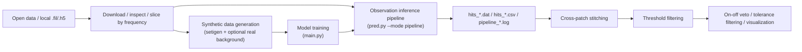

# MSWNet: A Full SETI Dynamic-Spectrum Pipeline

[](https://www.python.org/)
[](https://pytorch.org/)
[](LICENSE)

This repository should be understood as a **full end-to-end pipeline** for SETI-style radio dynamic-spectrum analysis, not just as a model repository.

`MSWNet` is one important component, but the actual workflow in this codebase includes:

1. Downloading, checking, and slicing `.fil` / `.h5` observation data
2. Generating synthetic training samples with `setigen`, optionally mixed with real filterbank backgrounds
3. Training `MSWNet` / `UNet` variants with checkpoint resume support
4. Running patch-wise inference on real observations, including dual-polarization handling
5. Exporting candidate hits and applying post-processing such as stitching, threshold filtering, and on-off veto

The core model is already public. The public repository link is [Riko-Neko/MSWNet](https://github.com/Riko-Neko/MSWNet). The main implementations in this repository are under [`model/`](model/).

## Pipeline Overview



## Repository Scope

- **The mainline workflow is the detection pipeline**. The default training entry is [`main.py`](main.py), and the default inference entry is [`pred.py`](pred.py).
- **The mainline public path is still the FAST-style observation pipeline built around `.fil` / `.h5` inputs**. That is the path emphasized in this README.
- **The core model is public**. Relevant implementations can be found in [`model/DetMSWNet.py`](model/DetMSWNet.py), [`model/MSWNet.py`](model/MSWNet.py), and [`model/UNet.py`](model/UNet.py).
- **The repository is organized around the full pipeline rather than a single model component**. Real use typically involves `data/`, `gen/`, `main.py`, `pred.py`, and `data_process/post_process/`.
- **Detection now has two backend styles under the same pipeline concept**:
  - the original regression head (`DetMSWNet -> decode_F`)
  - a lighter `trackline` backend (`MSWNet/DetMSWNet -> denoise -> line fitting`)
- **Experimental and historical directories are not the stable path**. `dev/`, `old/`, `abandoned/`, and `archived/` are mainly for experiments or legacy code.

## Visual Examples

### Synthetic Samples

| Clean | Noisy |
| --- | --- |
|  |  |

### MSWNet Prediction Examples

<p align="center">
  
  
  
</p>

## Repository Layout

| Path | Purpose |
| --- | --- |
| `main.py` | Training entry point. Defaults to detection mode and supports checkpoint resume. |
| `pred.py` | Inference entry point. Supports synthetic inference, observation inference, and full pipeline mode. |
| `config/` | Runtime profile definitions and environment-selected configuration loading. |
| `model/` | `MSWNet`, `DetMSWNet`, `UNet`, and detection-head implementations. |
| `gen/` | `setigen`-based dynamic-spectrum generation and dataset logic. |
| `pipeline/` | Observation patch extraction, pipeline processor, and UI renderer. |
| `utils/` | Detection decoding, SNR estimation, losses, and training/inference helpers. |
| `data/` | Filterbank / `.2C` inspection, download, and slicing utilities, plus local example layouts. |
| `data_process/` | `turbo_seti` comparison scripts, post-processing, statistics, and visualization tools. |
| `checkpoints/` | Saved weights and training logs. |
| `pred_results/` | Output plots from synthetic inference and saved example predictions. |
| `plot/` | Figures used for examples and visualization. |

## Installation

It is recommended to use a dedicated virtual environment:

```bash
git clone https://github.com/Riko-Neko/MSWNet.git
cd MSWUNet

python -m venv .venv
source .venv/bin/activate

python -m pip install --upgrade pip
pip install -r requirements.txt
```

### Dependency Notes

- `pred.py` imports `PyQt5` and `pipeline.renderer` at module import time, so **installing `PyQt5` is recommended even if you do not use `--ui`**.
- `turbo-seti` is only needed for the scripts under `data_process/TruboSETI_*.py`; it is not required for the main detection pipeline.
- Use **Python 3.10+ and PyTorch 2.x**.

## Runtime Profiles

Training and inference are now profile-driven rather than controlled by large blocks of hard-coded constants inside the entry scripts.

- Runtime profiles are defined in [`config/configs.py`](config/configs.py).
- The active profile is selected through the `CONFIG` environment variable.
- If `CONFIG` is not set, the repository falls back to the default profile.

The main public documentation below uses a short local profile named `quick_start`. It is intended as a compact public-facing example path for verifying the pipeline and synthetic workflow without exposing the longer internal observation-profile names in the README.

The repository also includes sidework support for **CE4 `.2C` observation products**, including dedicated runtime profiles and local inspection utilities. That support reuses the same overall pipeline ideas and now covers end-to-end inference compatibility, but it is still treated as a secondary branch in this README. The main documentation below continues to focus on the standard FAST-style pipeline built around synthetic generation, training, observation inference, and candidate post-processing.

## Data Conventions

### Observation Data

The mainline observation pipeline supports `.fil` and `.h5`.

Due to observation-side access and release requirements, this repository does **not** distribute real observation data such as FAST files. The repository is intended to provide the code, model implementations, pipeline logic, and synthetic testing path. Real observation files must be prepared separately by users who have the appropriate access and permissions.

For a short public-facing local example path, this README refers to the example two-polarization layout as **Quick Start**. In user-managed local storage, that layout can be organized as:

```text
data/<path-to-your-data>/xx/
data/<path-to-your-data>/yy/
```

The expected file naming pattern is still:

- the `Mxx` beam identifier
- the `_pol1` / `_pol2` polarization suffix

When polarization pairing is enabled by the selected profile, the pipeline matches the two directories by this naming convention and combines the paired inputs into `Stokes I` by default.

As a side branch, the repository also supports CE4 `.2C` data through dedicated profiles and utilities such as [`data/CE4_2C_checker.py`](data/CE4_2C_checker.py). In practice the entry is still [`pred.py`](pred.py), with the runtime profile deciding whether the observation path is the standard FAST-style `.fil` / `.h5` workflow or the auxiliary CE4 `.2C` workflow.

### Synthetic Training Data

[`gen/SETIdataset.py`](gen/SETIdataset.py) defines `DynamicSpectrumDataset`, which generates samples on the fly via [`gen/SETIgen.py`](gen/SETIgen.py) and `setigen`.

In the default detection path, each sample includes:

- `noisy_spec`
- `clean_spec`
- `gt_boxes = [f_start, f_end, class_id]`

The current detection head performs **1D frequency-interval regression**, not 2D object detection.

### Real Background Mixing

Some profiles mix real `.fil` backgrounds into synthetic samples, while others keep the synthetic path fully self-contained.

For example:

- observation-oriented profiles may reuse local filterbank directories as background sources
- the `quick_start` profile disables real-background mixing so that the synthetic path can be tested without additional observation files

If you are building a new profile, background usage should be treated as a profile-level choice rather than a fixed repository-wide requirement.

## Quick Start

The quickest way to test the repository is to stay entirely in the **synthetic** path. The steps below are designed so that anyone can run inference and a small training smoke test **without any real `.fil` observation files**.

For the public quick start, for example, place `mswnet-bin256-final.pth` from the `weights-v1` release under `checkpoints/<path-to-your-weights>/`, and place any local observation files under `data/<path-to-your-data>/`.

The `quick_start` profile intentionally uses placeholder paths such as `checkpoints/<path-to-your-...>/` and `data/<path-to-your-data>/`, so update them to match your local layout before running.

### Synthetic Quick Start Inference

Run:

```bash
CONFIG=quick_start python pred.py
```

By default this:

- loads the `quick_start` runtime profile from [`config/configs.py`](config/configs.py)
- generates synthetic inputs through `DynamicSpectrumDataset`
- expects a compatible checkpoint path defined in the `quick_start` profile
- writes plots to `pred_results/plots/MSWNet/`

### Synthetic Quick Start Training Smoke Test

Run:

```bash
CONFIG=quick_start python main.py -d 0
```

This uses the same short public validation profile and keeps the synthetic training path independent of external observation backgrounds.

For a very short smoke test, shorten the training-loop length inside the selected profile in [`config/configs.py`](config/configs.py), then run the same command again.

If you want to resume from saved best weights under the active profile:

```bash
CONFIG=quick_start python main.py -d 0 -l
```

### Local Observation Pipeline Validation

```bash
CONFIG=quick_start python pred.py --mode pipeline --verbose
```

This uses the same short profile name for the local two-polarization observation layout. Before running it on observation files, update the `quick_start` profile paths to your local `data/<path-to-your-data>/xx/` and `data/<path-to-your-data>/yy/` layout.

## Inference Pipeline

### Inference Modes

[`pred.py`](pred.py) supports several practical run modes:

| Command | Purpose |
| --- | --- |
| `python pred.py` | Single-model inference on synthetic data, mainly for visualization. |
| `python pred.py --obs` | Runs the default single-model inference path on observation data, but this is closer to single-file inspection than full batch processing. |
| `python pred.py --mode pipeline` | Full observation pipeline over files or polarization groups, including patch processing and hit export. |
| `python pred.py --mode pipeline --ui` | Same pipeline, with the PyQt visualization interface enabled. |

### Configuration You Usually Need to Edit First

Most pipeline controls are now defined through runtime profiles in [`config/configs.py`](config/configs.py).

Before running on real observations, review the active profile in four groups:

1. **Input layout**
   - observation root path
   - accepted suffixes such as `.fil`, `.h5`, or `.2C`
   - polarization handling rules
   - optional beam filtering
2. **Patch geometry**
   - time / frequency patch size
   - overlap ratio
   - adaptive time scaling behavior
3. **Model compatibility**
   - checkpoint path
   - detector backend
   - detector width and frequency resolution assumptions
4. **Candidate filtering**
   - NMS thresholds
   - patch-level SNR gates
   - drift / dedrift settings

These values are adjustable profile parameters. The main consistency rule is that patch width, detector width, detector backend, and checkpoint selection must match each other.

### Patch Extraction Logic

The full observation pipeline uses `SETIWaterFullDataset` from [`pipeline/patch_engine.py`](pipeline/patch_engine.py).

Two implementation details are important:

1. **The time axis is usually not split into multiple patches**
   - `SETIWaterFullDataset(..., t_adaptive=True)` adapts `patch_t` to the available observation length
   - this often means a single patch row across time, with sliding windows mainly along frequency
2. **The frequency axis is processed by fixed-width sliding windows**
   - default `patch_f = 256`
   - default `overlap_pct = 0.02`

That is why pipeline outputs often show:

- nearly fixed `cell_row`
- very large `cell_col`

### Full Observation Inference Commands

Batch pipeline without UI:

```bash
python pred.py --mode pipeline --verbose
```

Pipeline with UI:

```bash
python pred.py --mode pipeline --ui
```

### What the Pipeline Actually Does

In `python pred.py --mode pipeline`, the workflow is:

1. Collect `.fil` / `.h5` files from the configured directories
2. Match polarization pairs using `Mxx` and the shared filename base
3. Combine matched polarization files into `Stokes I` or `Q`
4. Build `SETIWaterFullDataset`
5. Load the configured `MSWNet` checkpoint
6. For each frequency patch:
   - normalize the patch
   - denoise it
   - run the configured detection backend
   - either regress frequency start/end positions and decode confidence scores
   - or run the lighter trackline path on the denoised patch
   - apply patch-level `gSNR` filtering
   - export candidate hits
7. Write logs and candidate tables to disk

### Pipeline Outputs

Each run creates files under `pipeline/log/<log_dir>/`:

- `pipeline_YYYYMMDD_HHMMSS.log`
- `hits_YYYYMMDD_HHMMSS.dat`
- `hits_YYYYMMDD_HHMMSS.csv`

The `.csv` file is the sorted version of the `.dat` file.

Important columns depend slightly on the selected detection backend, but the main exported fields include:

| Column | Meaning |
| --- | --- |
| `DriftRate` | Drift rate in Hz/s |
| `SNR` | Local candidate SNR |
| `Uncorrected_Frequency` | Candidate frequency in MHz |
| `freq_start`, `freq_end` | Candidate frequency bounds in MHz |
| `class_id` | Detection-head class output in the original regression backend |
| `confidence` | Detection-head confidence in the original regression backend, or compatibility score in the trackline backend |
| `Score` | Trackline backend score |
| `RMSE`, `NPoints` | Trackline backend line-fit diagnostics |
| `cell_row`, `cell_col` | Patch-grid coordinates |
| `gSNR` | Patch-level global SNR |
| `freq_min`, `freq_max` | Frequency range covered by the patch |
| `time_start`, `time_end` | Time range covered by the patch |
| `mode` | Current operating mode, usually `detection` |

### `--obs` vs `--mode pipeline`

These two are easy to confuse:

- `--obs` is closer to “run the current inference logic on observation data and inspect the result”
- `--mode pipeline` is the actual batch-processing path for exporting candidates from observation directories

Also, when `--obs` is used with `ignore_polarization=True`, the current code only uses the **first matched polarization group**; `--mode pipeline` iterates over all matched files or file groups.

## Training Flow

### Main Entry

The training entry point is [`main.py`](main.py). The main stack is:

- dataset: `DynamicSpectrumDataset`
- model: `model.DetMSWNet.MSWNet`
- loss: `DetectionCombinedLoss`

### Training Configuration

Training settings are loaded from the active runtime profile in [`config/configs.py`](config/configs.py).

Typical profile-level training fields include:

- time / frequency resolution
- synthetic signal range
- batch size and loop length
- optimizer and scheduler settings
- checkpoint directory
- detector width and output count
- backbone-freezing strategy

These values should be treated as editable run parameters rather than fixed recommendations.

For backbone freezing:

- `False` means joint optimization of backbone and detector
- `True` means freezing the backbone and emphasizing detector-only optimization

A practical training schedule is to use joint training earlier and switch to detector-focused fine-tuning later to further strengthen the detection module.

### Training Outputs

Training writes:

- `training_log.csv`
- `epoch_log.csv`
- `best_model.pth`
- `model_epoch_*.pth`

The code keeps rolling checkpoints and updates `best_model.pth` when validation improves.

### About the Mask Path

The repository still contains mask / RFI-mask-related code, losses, and historical branches, but the default public workflow is the detection pipeline.

If you want to use the mask path, you should verify:

- model output format
- loss compatibility
- checkpoint compatibility

So this README does not present mask training as the default ready-to-run workflow.

## Observation Data Utilities

### Download Open Data

[`data/FILTERBANK_puller.py`](data/FILTERBANK_puller.py) downloads filterbank files from the SETI Berkeley Open Data API:

```bash
python data/FILTERBANK_puller.py \
  --targets "HIP17147" \
  --telescope "GBT" \
  --save-dir "./data/BLIS692NS/BLIS692NS_data"
```

### Inspect a Filterbank

```bash
python data/FILTERBANK_checker.py <your_filterbank_file.fil>
```

### Slice by Frequency Range

```bash
python data/FILTERBANK_spiliter.py \
  <your_filterbank_file.fil> \
  --f_start <start_mhz> \
  --f_stop <stop_mhz> \
  --output_dir <output_dir>
```

## Post-Processing Workflow

`pred.py --mode pipeline` produces the raw candidate tables, but de-duplication, stitching, and veto logic live under [`data_process/post_process/`](data_process/post_process/).

### Step 1: Organize Pipeline Outputs

One important practical detail:

- `pred.py --mode pipeline` writes time-stamped `hits_*.csv`
- scripts under `data_process/post_process/filter_workflow/` generally expect target- and beam-aware filenames such as:
  - `<target>_M01.csv`
  - `<target>_M02.csv`

So there is currently **no one-shot script that automatically renames everything from `pipeline/log/` into the downstream post-processing layout**.

In practice you usually collect and rename the exported hit tables into something like:

```text
data_process/post_process/filter_workflow/init/
  <target>_M01.csv
  <target>_M02.csv
  ...
```

### Step 2: Cross-Patch Stitching

Recommended usage:

```bash
python data_process/post_process/stitching.py \
  --input_dir data_process/post_process/filter_workflow/init
```

Notes:

- this performs cross-patch boundary stitching
- its default relative paths are more convenient when run from inside `data_process/post_process/`
- from the repository root, passing `--input_dir` explicitly is the safest option

### Step 3: Threshold Filtering

Filter stitched results by band, confidence, `gSNR`, and `SNR`:

```bash
python data_process/post_process/main_filter.py \
  --input_dir <stitching_output_dir>
```

If the input directory contains `case_summary.csv`, the script automatically treats it as a stitching output directory.

### Step 4: On-Off Veto

```bash
python data_process/post_process/on-off_veto.py \
  --input_csv <total_csv_path>
```

The default logic is:

- `beam_id == 1` is treated as ON-source
- all other beams are treated as OFF-source
- veto is applied through frequency tolerance matching

### Additional Filters and Statistics

- [`data_process/post_process/tol_filter.py`](data_process/post_process/tol_filter.py): additional filtering by frequency, SNR, drift rate, group, or beam
- [`data_process/post_process/stats.py`](data_process/post_process/stats.py): grouped summary statistics
- [`data_process/post_process/visual_val/`](data_process/post_process/visual_val/): post-processing visualizations

## Weight and Output Paths

The codebase uses the following local paths for checkpoints, exported figures, and runtime logs:

- `checkpoints/mswunet/bin256/`
- `checkpoints/mswunet/bin1024/`
- `checkpoints/unet/`
- `pred_results/plots/MSWNet/`
- `pred_results/plots/UNet/`
- `pipeline/log/`

Weight files such as `.pth` and runtime log outputs are local artifacts and may not be visible in a fresh clone.

When choosing a checkpoint, width matching still matters:

- checkpoints under `bin256/` should be matched with `fchans = 256` / `patch_f = 256`
- checkpoints under `bin1024/` should be matched with `fchans = 1024`

## Practical Caveats

1. Many important settings are profile-driven through `config/configs.py` rather than fully exposed through the CLI.
2. `pred.py` currently expects `PyQt5` to be installed even if you do not use `--ui`.
3. Profiles that enable real-background mixing require matching local data sources; profiles such as `quick_start` avoid that dependency.
4. Inference currently assumes `batch_size = 1`.
5. Downstream post-processing depends on consistent CSV naming, so there is still a manual handoff between raw pipeline outputs and the post-processing workflow.
6. Code under `dev/`, `old/`, `abandoned/`, and `archived/` should not be assumed to match the current mainline behavior.

## License

This project is released under the [MIT License](LICENSE).

## Citation

If you want to cite the repository itself, you can currently use:

```bibtex
@software{mswnet_repo,
  author = {Riko-Neko},
  title = {MSWNet},
  url = {https://github.com/Riko-Neko/MSWNet},
  year = {2026}
}
```

A paper-specific citation will be added once published.
