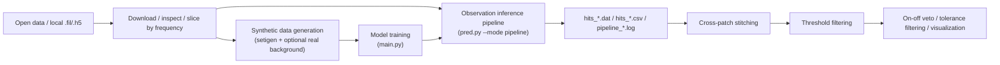
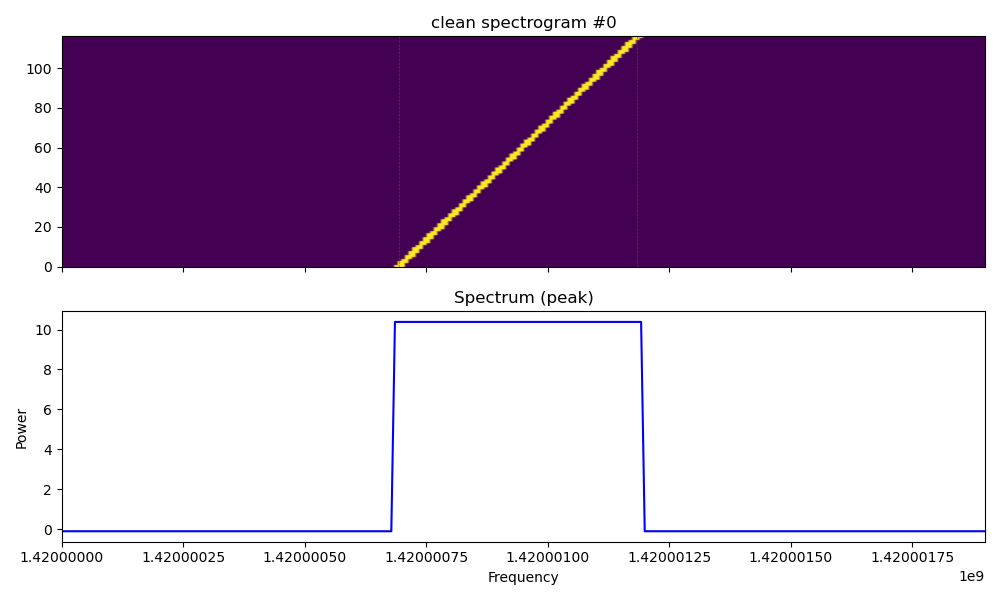
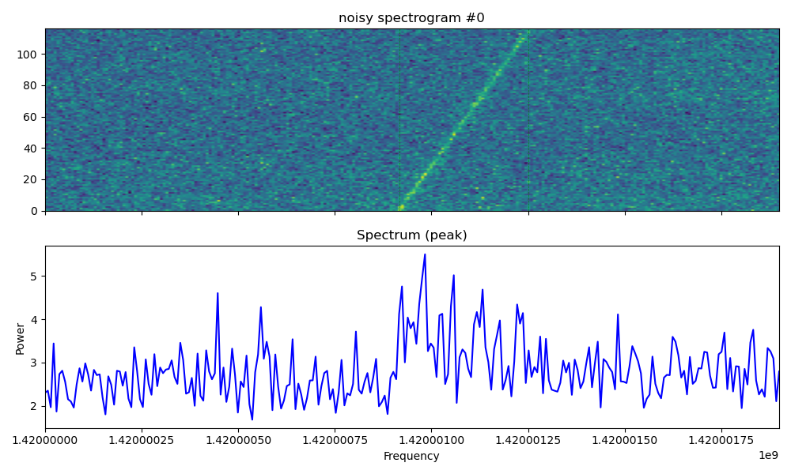
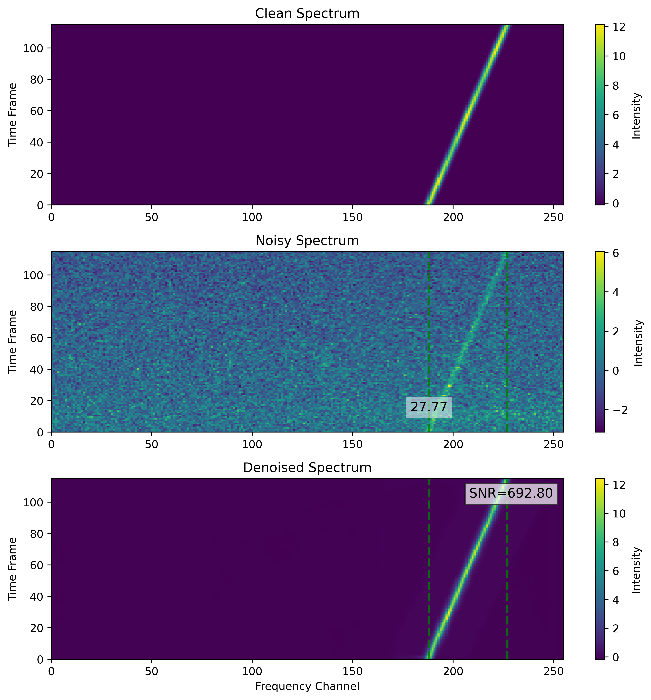
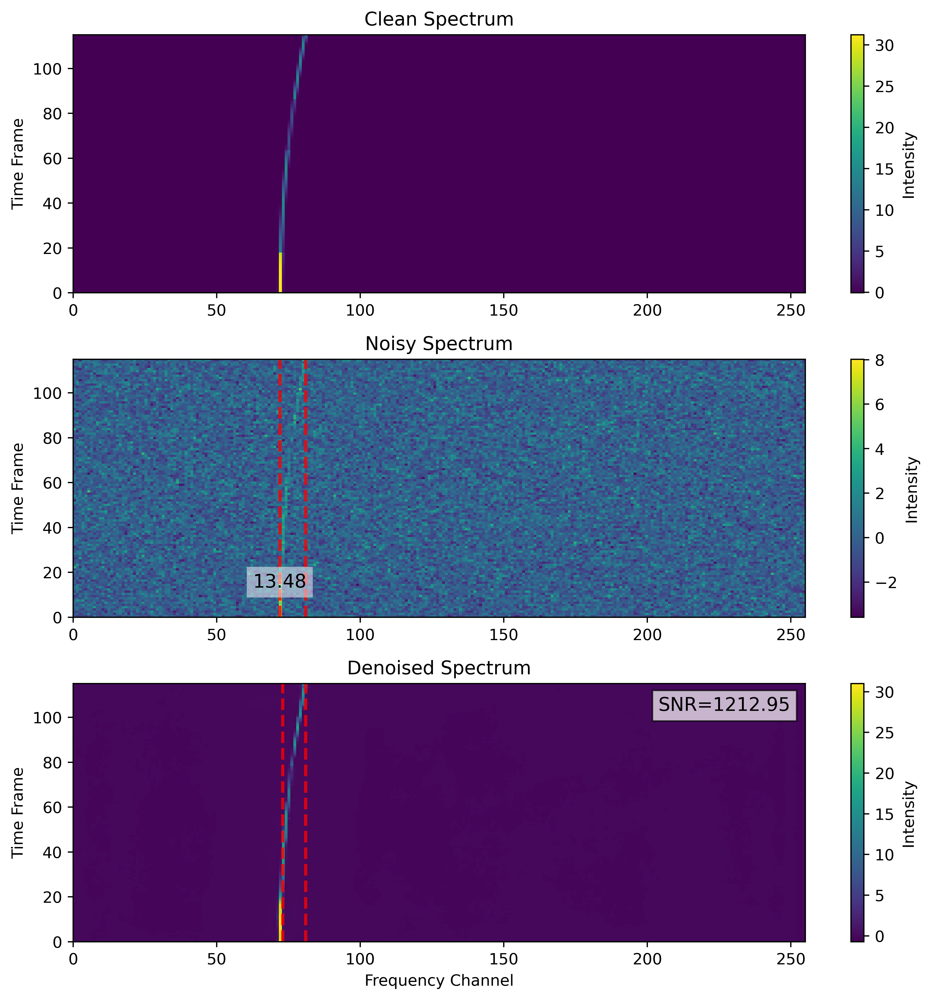
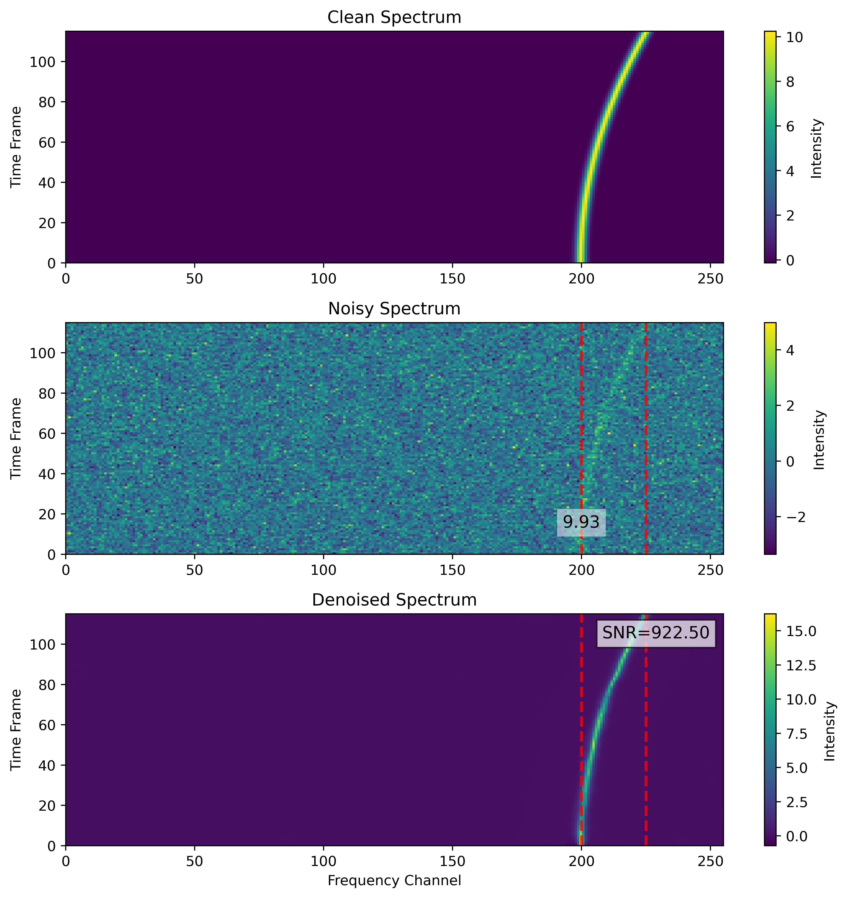

# MSWNet: A Full SETI Dynamic-Spectrum Pipeline

[](https://www.python.org/)
[](https://pytorch.org/)
[](LICENSE)

This repository should be understood as a **full end-to-end pipeline** for SETI-style radio dynamic-spectrum analysis, not just as a model repository.

`MSWNet` is one important component, but the actual workflow in this codebase includes:

1. Downloading, checking, and slicing `.fil` / `.h5` observation data
2. Generating synthetic training samples with `setigen`, optionally mixed with real filterbank backgrounds
3. Training `MSWNet` / `UNet` variants with checkpoint resume support
4. Running patch-wise inference on real observations, including dual-polarization handling
5. Exporting candidate hits and applying post-processing such as stitching, threshold filtering, and on-off veto

The core model is already public. The public repository link is [Riko-Neko/MSWNet](https://github.com/Riko-Neko/MSWNet). The main implementations in this repository are under [`model/`](model/).

## Pipeline Overview



## Repository Scope

- **The mainline workflow is the detection pipeline**. The default training entry is [`main.py`](main.py), and the default inference entry is [`pred.py`](pred.py).
- **The core model is public**. Relevant implementations can be found in [`model/DetMSWNet.py`](model/DetMSWNet.py), [`model/MSWNet.py`](model/MSWNet.py), and [`model/UNet.py`](model/UNet.py).
- **The repository is organized around the full pipeline rather than a single model component**. Real use typically involves `data/`, `gen/`, `main.py`, `pred.py`, and `data_process/post_process/`.
- **Experimental and historical directories are not the stable path**. `dev/`, `old/`, `abandoned/`, and `archived/` are mainly for experiments or legacy code.

## Visual Examples

### Synthetic Samples

| Clean | Noisy |
| --- | --- |
|  |  |

### MSWNet Prediction Examples

<p align="center">
  
  
  
</p>

## Repository Layout

| Path | Purpose |
| --- | --- |
| `main.py` | Training entry point. Defaults to detection mode and supports checkpoint resume. |
| `pred.py` | Inference entry point. Supports synthetic inference, observation inference, and full pipeline mode. |
| `model/` | `MSWNet`, `DetMSWNet`, `UNet`, and detection-head implementations. |
| `gen/` | `setigen`-based dynamic-spectrum generation and dataset logic. |
| `pipeline/` | Observation patch extraction, pipeline processor, and UI renderer. |
| `utils/` | Detection decoding, SNR estimation, losses, and training/inference helpers. |
| `data/` | Filterbank download, inspection, and slicing scripts, plus sample data. |
| `data_process/` | `turbo_seti` comparison scripts, post-processing, statistics, and visualization tools. |
| `checkpoints/` | Saved weights and training logs. |
| `pred_results/` | Output plots from synthetic inference and saved example predictions. |
| `plot/` | Figures used for examples and visualization. |

## Installation

It is recommended to use a dedicated virtual environment:

```bash
git clone https://github.com/Riko-Neko/MSWNet.git
cd MSWUNet

python -m venv .venv
source .venv/bin/activate

python -m pip install --upgrade pip
pip install -r requirements.txt
```

### Dependency Notes

- `pred.py` imports `PyQt5` and `pipeline.renderer` at module import time, so **installing `PyQt5` is recommended even if you do not use `--ui`**.
- `turbo-seti` is only needed for the scripts under `data_process/TruboSETI_*.py`; it is not required for the main detection pipeline.
- Use **Python 3.10+ and PyTorch 2.x**.

## Data Conventions

### Observation Data

The main pipeline supports `.fil` and `.h5`.

Due to observation-side access and release requirements, this repository does **not** distribute real observation data such as FAST files. The repository is intended to provide the code, model implementations, pipeline logic, and synthetic testing path. Real observation files must be prepared separately by users who have the appropriate access and permissions.

The default observation layout used by the repository is:

```text
data/
  33exoplanets/
    xx/
      <target>_M01_pol1_*.fil
      <target>_M02_pol1_*.fil
      ...
    yy/
      <target>_M01_pol2_*.fil
      <target>_M02_pol2_*.fil
      ...
```

When `ignore_polarization = True` in [`pred.py`](pred.py), the code matches files using:

- the `Mxx` beam identifier
- the `_pol1` / `_pol2` polarization suffix

and combines the paired inputs into `Stokes I` by default.

### Synthetic Training Data

[`gen/SETIdataset.py`](gen/SETIdataset.py) defines `DynamicSpectrumDataset`, which generates samples on the fly via [`gen/SETIgen.py`](gen/SETIgen.py) and `setigen`.

In the default detection path, each sample includes:

- `noisy_spec`
- `clean_spec`
- `gt_boxes = [f_start, f_end, class_id]`

The current detection head performs **1D frequency-interval regression**, not 2D object detection.

### Real Background Mixing

One training configuration currently shown in [`main.py`](main.py) includes:

```python
use_fil = True
fil_folder = Path('./data/33exoplanets/bg/clean')
```

This means training will try to mix real `.fil` backgrounds into synthetic samples.

If that directory does not exist or does not contain valid background files, you can either:

- point `fil_folder` to your own background directory, or
- set `use_fil = False`

Otherwise the training dataset configuration will not match the intended setup.

## Quick Start

The quickest way to test the repository is to stay entirely in the **synthetic** path. The steps below are designed so that anyone can run inference and a small training smoke test **without any real `.fil` observation files**.

### Synthetic Inference Without Any Real Observation Files

Run:

```bash
python pred.py
```

By default this:

- uses the detection configuration defined at the top of [`pred.py`](pred.py)
- generates synthetic inputs through `DynamicSpectrumDataset`
- loads `checkpoints/mswunet/bin256/final.pth`
- writes plots to `pred_results/plots/MSWNet/`

### Synthetic Training Smoke Test Without Any Real Observation Files

Before running training for the first time without real background filterbank files, edit [`main.py`](main.py) and set:

```python
use_fil = False
```

This disables the optional real-background mixing path and keeps training fully synthetic.

For a short smoke test, it is also practical to temporarily reduce:

```python
num_epochs = 1
steps_per_epoch = 5
valid_steps = 2
```

Then run:

```bash
python main.py -d 0
```

If you want to resume a longer synthetic run from the saved best weights:

```bash
python main.py -d 0 -l
```

The main training configuration lives near the top of [`main.py`](main.py), not in a full CLI. The values there are intended to be adjusted for the training target, data regime, and stage of training. One current example configuration includes:

- `mode = "detection"`
- `fchans = 1024`
- `checkpoint_dir = "./checkpoints/mswunet/bin1024"`
- `freeze_backbone = True`

These are tunable training parameters, not fixed rules.

For `freeze_backbone` specifically:

- `freeze_backbone = False` trains the backbone and detector jointly
- `freeze_backbone = True` freezes the backbone and updates only the detection module

A practical strategy is to begin training with `freeze_backbone = False`, then switch to `freeze_backbone = True` in later-stage training to strengthen the detector module.

## Inference Pipeline

### Inference Modes

[`pred.py`](pred.py) supports several practical run modes:

| Command | Purpose |
| --- | --- |
| `python pred.py` | Single-model inference on synthetic data, mainly for visualization. |
| `python pred.py --obs` | Runs the default single-model inference path on observation data, but this is closer to single-file inspection than full batch processing. |
| `python pred.py --mode pipeline` | Full observation pipeline over files or polarization groups, including patch processing and hit export. |
| `python pred.py --mode pipeline --ui` | Same pipeline, with the PyQt visualization interface enabled. |

### Configuration You Usually Need to Edit First

Most important pipeline controls are defined as top-level constants inside [`pred.py`](pred.py), not passed through CLI arguments.

Before running on real observations, check at least the following:

#### Input and Polarization

- `XX_dir`
- `YY_dir`
- `obs_file_path`
- `ignore_polarization`
- `stokes_mode`
- `Beam`

With the current defaults:

- `ignore_polarization = True`
- `stokes_mode = "I"`
- `obs_file_path = [XX_dir, YY_dir]`

the code pairs files from `xx/` and `yy/` directories by filename and beam ID, then processes them as polarization pairs.

#### Patch Width and Model Width

- `patch_f = 256`
- `fchans = 256`
- `dwtnet_ckpt = Path("./checkpoints/mswunet/bin256") / "final.pth"`
- `detector_args["fchans"] = fchans`

These values are adjustable, but they must stay mutually consistent.

If you switch from `256`-wide frequency patches to `1024`, you should also switch:

- the checkpoint
- `fchans`
- `detector_args`

Otherwise the detector head dimensions will no longer match the model weights.

#### Thresholds and Post-Filtering

- `nms_kargs["score_thresh"]`
- `nms_kargs["iou_thresh"]`
- `fsnr_args["fsnr_threshold"]`
- `snr_threshold`
- `pad_fraction`

These directly affect:

- whether a patch is considered positive
- whether a hit is written to CSV / DAT
- how candidate SNR is estimated

### Patch Extraction Logic

The full observation pipeline uses `SETIWaterFullDataset` from [`pipeline/patch_engine.py`](pipeline/patch_engine.py).

Two implementation details are important:

1. **The time axis is usually not split into multiple patches**
   - `SETIWaterFullDataset(..., t_adaptive=True)` adapts `patch_t` to the available observation length
   - this often means a single patch row across time, with sliding windows mainly along frequency
2. **The frequency axis is processed by fixed-width sliding windows**
   - default `patch_f = 256`
   - default `overlap_pct = 0.02`

That is why pipeline outputs often show:

- nearly fixed `cell_row`
- very large `cell_col`

### Full Observation Inference Commands

Batch pipeline without UI:

```bash
python pred.py --mode pipeline --verbose
```

Pipeline with UI:

```bash
python pred.py --mode pipeline --ui
```

### What the Pipeline Actually Does

In `python pred.py --mode pipeline`, the workflow is:

1. Collect `.fil` / `.h5` files from the configured directories
2. Match polarization pairs using `Mxx` and the shared filename base
3. Combine matched polarization files into `Stokes I` or `Q`
4. Build `SETIWaterFullDataset`
5. Load the configured `MSWNet` checkpoint
6. For each frequency patch:
   - normalize the patch
   - denoise it
   - regress frequency start/end positions
   - decode confidence scores
   - apply patch-level `gSNR` filtering
   - export candidate hits
7. Write logs and candidate tables to disk

### Pipeline Outputs

Each run creates files under `pipeline/log/<log_dir>/`:

- `pipeline_YYYYMMDD_HHMMSS.log`
- `hits_YYYYMMDD_HHMMSS.dat`
- `hits_YYYYMMDD_HHMMSS.csv`

The `.csv` file is the sorted version of the `.dat` file.

Important columns include:

| Column | Meaning |
| --- | --- |
| `DriftRate` | Drift rate in Hz/s |
| `SNR` | Local candidate SNR |
| `Uncorrected_Frequency` | Candidate frequency in MHz |
| `freq_start`, `freq_end` | Candidate frequency bounds in MHz |
| `class_id` | Detection-head class output |
| `confidence` | Detection-head confidence |
| `cell_row`, `cell_col` | Patch-grid coordinates |
| `gSNR` | Patch-level global SNR |
| `freq_min`, `freq_max` | Frequency range covered by the patch |
| `time_start`, `time_end` | Time range covered by the patch |
| `mode` | Current operating mode, usually `detection` |

### `--obs` vs `--mode pipeline`

These two are easy to confuse:

- `--obs` is closer to “run the current inference logic on observation data and inspect the result”
- `--mode pipeline` is the actual batch-processing path for exporting candidates from observation directories

Also, when `--obs` is used with `ignore_polarization=True`, the current code only uses the **first matched polarization group**; `--mode pipeline` iterates over all matched files or file groups.

## Training Flow

### Main Entry

The training entry point is [`main.py`](main.py). The default stack is:

- dataset: `DynamicSpectrumDataset`
- model: `model.DetMSWNet.MSWNet`
- loss: `DetectionCombinedLoss`

### Training Configuration

The detection configuration currently written in [`main.py`](main.py) includes:

- `mode = "detection"`
- `tchans = 116`
- `fchans = 1024`
- `batch_size = 16`
- `num_epochs = 1000`
- `steps_per_epoch = 200`
- `lr = 0.001`
- `checkpoint_dir = "./checkpoints/mswunet/bin1024"`
- `freeze_backbone = True`

These values should be treated as editable run parameters rather than fixed recommendations.

For `freeze_backbone`:

- `False` means joint optimization of backbone and detector
- `True` means freezing the backbone and emphasizing detector-only optimization

A practical training schedule is to use `freeze_backbone = False` earlier in training and switch to `freeze_backbone = True` later to further strengthen the detection module.

### Training Outputs

Training writes:

- `training_log.csv`
- `epoch_log.csv`
- `best_model.pth`
- `model_epoch_*.pth`

The code keeps rolling checkpoints and updates `best_model.pth` when validation improves.

### About the Mask Path

The repository still contains mask / RFI-mask-related code, losses, and historical branches, but the default public workflow is the detection pipeline.

If you want to use the mask path, you should verify:

- model output format
- loss compatibility
- checkpoint compatibility

So this README does not present mask training as the default ready-to-run workflow.

## Observation Data Utilities

### Download Open Data

[`data/FILTERBANK_puller.py`](data/FILTERBANK_puller.py) downloads filterbank files from the SETI Berkeley Open Data API:

```bash
python data/FILTERBANK_puller.py \
  --targets "HIP17147" \
  --telescope "GBT" \
  --save-dir "./data/BLIS692NS/BLIS692NS_data"
```

### Inspect a Filterbank

```bash
python data/FILTERBANK_checker.py data/33exoplanets/xx/Kepler-438_M01_pol1_f1140.50-1140.70.fil
```

### Slice by Frequency Range

```bash
python data/FILTERBANK_spiliter.py \
  data/33exoplanets/xx/Kepler-438_M01_pol1.fil \
  --f_start 1140.50 \
  --f_stop 1140.70 \
  --output_dir ./data/33exoplanets/xx
```

## Post-Processing Workflow

`pred.py --mode pipeline` produces the raw candidate tables, but de-duplication, stitching, and veto logic live under [`data_process/post_process/`](data_process/post_process/).

### Step 1: Organize Pipeline Outputs

One important practical detail:

- `pred.py --mode pipeline` writes time-stamped `hits_*.csv`
- scripts under `data_process/post_process/filter_workflow/` generally expect target- and beam-aware filenames such as:
  - `Kepler-438_M01.csv`
  - `Kepler-438_M02.csv`

So there is currently **no one-shot script that automatically renames everything from `pipeline/log/` into the downstream post-processing layout**.

In practice you usually collect and rename the exported hit tables into something like:

```text
data_process/post_process/filter_workflow/init/
  Kepler-438_M01.csv
  Kepler-438_M02.csv
  ...
```

### Step 2: Cross-Patch Stitching

Recommended usage:

```bash
python data_process/post_process/stitching.py \
  --input_dir data_process/post_process/filter_workflow/init
```

Notes:

- this performs cross-patch boundary stitching
- its default relative paths are more convenient when run from inside `data_process/post_process/`
- from the repository root, passing `--input_dir` explicitly is the safest option

### Step 3: Threshold Filtering

Filter stitched results by band, confidence, `gSNR`, and `SNR`:

```bash
python data_process/post_process/main_filter.py \
  --input_dir <stitching_output_dir>
```

If the input directory contains `case_summary.csv`, the script automatically treats it as a stitching output directory.

### Step 4: On-Off Veto

```bash
python data_process/post_process/on-off_veto.py \
  --input_csv <total_csv_path>
```

The default logic is:

- `beam_id == 1` is treated as ON-source
- all other beams are treated as OFF-source
- veto is applied through frequency tolerance matching

### Additional Filters and Statistics

- [`data_process/post_process/tol_filter.py`](data_process/post_process/tol_filter.py): additional filtering by frequency, SNR, drift rate, group, or beam
- [`data_process/post_process/stats.py`](data_process/post_process/stats.py): grouped summary statistics
- [`data_process/post_process/visual_val/`](data_process/post_process/visual_val/): post-processing visualizations

## Existing Checkpoints and Outputs

The repository already includes several useful weights and example outputs:

- `checkpoints/mswunet/bin256/final.pth`
- `checkpoints/mswunet/bin1024/best_model.pth`
- `checkpoints/unet/best_model.pth`
- `pred_results/plots/MSWNet/`
- `pred_results/plots/UNet/`
- `pipeline/log/`

Checkpoint width matters:

- `bin256` weights correspond to `fchans = 256` / `patch_f = 256`
- `bin1024` weights correspond to `fchans = 1024`

## Practical Caveats

1. Many important settings are not exposed through the CLI and must be edited in the script constants.
2. `pred.py` currently expects `PyQt5` to be installed even if you do not use `--ui`.
3. The default training setup expects real background files under `data/33exoplanets/bg/clean`; if that is not available, you need to change `use_fil` or `fil_folder`.
4. Inference currently assumes `batch_size = 1`.
5. Downstream post-processing depends on consistent CSV naming, so there is still a manual handoff between raw pipeline outputs and the post-processing workflow.
6. Code under `dev/`, `old/`, `abandoned/`, and `archived/` should not be assumed to match the current mainline behavior.

## License

This project is released under the [MIT License](LICENSE).

## Citation

If you want to cite the repository itself, you can currently use:

```bibtex
@software{mswnet_repo,
  author = {Riko-Neko},
  title = {MSWNet},
  url = {https://github.com/Riko-Neko/MSWNet},
  year = {2026}
}
```

A paper-specific citation will be added once published.
